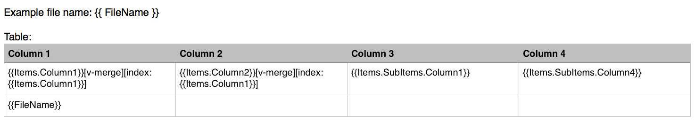

# DOCX templater on GoLang

Simple **.docx** (MS Word XML document) template based document generator using handlebars.

Takes input **.docx** documents with mustache sippets in it and renders new document with snippets replaced by provided context.

Thanks to `github.com/aymerick/raymond` for useful libs.

## Installation

```
go get -u github.com/legion-zver/go-docx-templates
```

## Usage (demo)

### Template example.docx



### demo.go

```go
package main

import (
    "fmt"    
    "github.com/legion-zver/go-docx-templates"
)

type TestStruct struct {
    FileName string
    Items []TestItemStruct
}

type TestItemStruct struct {
    Column1 string
    Column2 string    
    SubItems []TestItemStruct2
}

type TestItemStruct2 struct {
    Column1 string
    Column4 string    
}

func main() {
    template, err := docxt.OpenTemplate("./example.docx")
    if err != nil {
        fmt.Println(err)
        return
    }  
    test := new(TestStruct)
    test.FileName = "example.docx"
    test.Items = []TestItemStruct{
        TestItemStruct{"1","2",[]TestItemStruct2{TestItemStruct2{"3","4"},TestItemStruct2{"5","6"}}},
        TestItemStruct{"3","4",[]TestItemStruct2{TestItemStruct2{"7","8"},TestItemStruct2{"9","10"}}},
    }    
    if err := template.RenderTemplate(test); err != nil {
        fmt.Println(err)
        return
    }
    if err := template.Save("result.docx"); err != nil {
        fmt.Println(err)
        return
    }
    fmt.Println("Success")
}
```

### Result result.docx


